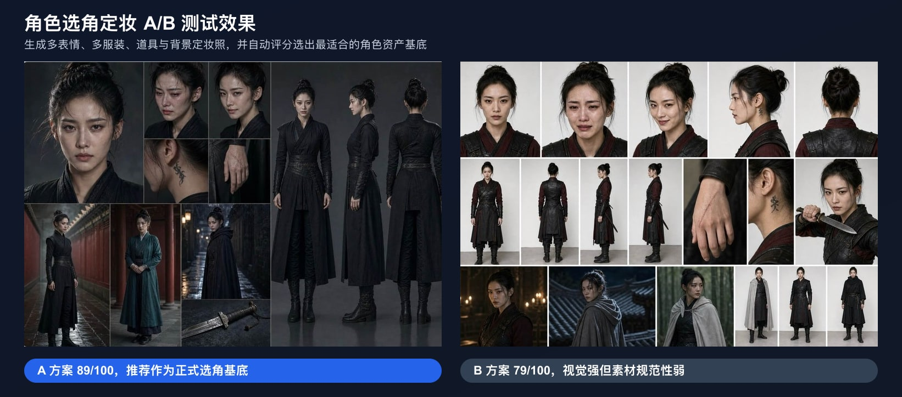

<p align="center">
  <a href="https://www.waoowaoo.com/">
    
  </a>
</p>

<p align="center">
  
</p>

<h1 align="center">waoowaoo AI 影视 Studio</h1>

<p align="center">
  一款基于 AI 技术的短剧/漫画视频制作工具，支持从小说文本自动生成分镜、角色、场景，并制作成完整视频。
</p>

<p align="center">
  <a href="README_en.md">English</a> · <a href="https://www.waoowaoo.com/">加入内测候补</a> · <a href="https://github.com/saturndec/waoowaoo/issues">反馈问题</a>
</p>

> [!IMPORTANT]
> ⚠️ **测试版声明**：本项目目前处于测试初期阶段，由于暂时只有我一个人开发，存在部分 bug 和不完善之处。我们正在快速迭代更新中，**欢迎进群反馈问题和需求，及时关注项目更新！目前更新会非常频繁，后续会增加大量新功能以及优化效果，我们的目标是成为行业最强AI工具！**
> ℹ️ **内部开发测试版说明**：该版本为内部开发测试版。如需在项目途中更改参数、调整生成策略或修正后台数据，请通过 Codex、Claude Code（CC）等 AI coding 工具从后台直接更改。


---
## ✨ 功能特性

- 🎬 **结构化剧本生成** — 从故事前提出发，逐层构建主角、创伤、欲望、关系网络、场景目标、价值摇摆与台词潜台词，让剧本更有结构，也更有语言辨识度
- 🎨 **智能风格案例生成** — 剧本完成后自动生成真人与动画两组风格方向，并从不同元素库中匹配地域、时代、材质、色彩、镜头气质等元素，组合成可选择的最终风格案例
- 👥 **角色选角定妆生成** — 根据剧本与风格案例，为同一角色生成三组不同的选角/定妆方向与参考照，并自动进行多维度评分，选出综合得分最高的角色资产基底
- 🏠 **场景 & 道具生成** — 场景与道具直接根据剧本和已选风格案例生成，减少全局模板干扰，让资产更贴合具体故事世界
- 🎥 **单场戏视听调度** — 打光、景别、景深、调度、表演等细节下沉到单场戏，而不是作为全局约束，增强每场戏的叙事表现力
- 🎙️ **AI 配音** — 多角色语音合成
- 🌐 **多语言支持** — 中文 / 英文界面，右上角一键切换

---

## 🧠 新版创作流程设计

新版流程把“全局模板约束”改成“剧本驱动的分层生成”，让 agent 先理解故事，再生成风格、资产与分镜。

### 1. 剧本生成：七层结构法

剧本不再只做简单扩写，而是按以下层级逐步生成：

1. **Premise Layer**：明确用户原始故事前提。
2. **Story Development Layer**：拆解主角、创伤、Want / Need、主题、反派、角色网络、命运网络、压力阶梯和关键选择。
3. **Location / Voice Layer**：确定具体城市、地域纹理、生活细节与人物语言系统。
4. **Scene Layer**：为每场戏设定目标、障碍、策略、结果和价值变化。
5. **Value Swing Layer**：检查每场戏的价值摇摆，例如 `+ / - / ++ / -- / +++`。
6. **Beat Layer**：细化每场戏内部的 `Action -> Reaction -> New Situation`。
7. **Dialogue Layer**：围绕角色 Want、Tactic、Subtext、Surface Dialogue 生成台词，并平衡自然对话和剧情推进。

### 2. 风格案例：真人 / 动画双路线

剧本完成后，系统会生成真人与动画两组风格案例。每组风格不再依赖单一关键词，而是由元素库组合而成：地域质感、年代气息、摄影语言、材质、色彩、角色气质、环境密度等元素会由 agent 根据剧本智能匹配，形成可比较、可选择的最终风格方向。

### 3. 角色资产：同一角色的三组选角方案

角色生成流程先抽取 Character DNA，再规划三个互斥的 Casting Directions，最后分别生成 Appearance Descriptor、Image Prompt 与定妆参考照。三组结果必须是“同一个角色的不同选角方向”，而不是三个无关角色，也不是换衣服式微调。系统会从角色贴合度、风格一致性、定妆完整度、差异度与可用于后续生产的稳定性等维度评分，并默认选出综合得分最高者。

### 4. 场景与道具：跟随剧本和风格案例

场景、道具直接依据剧本信息和已选风格案例生成，优先服务具体场景的叙事功能。它们不再被单独的全局风格圣经强行统一，而是在同一个故事世界观下保留场次差异。

### 5. 单场戏细分：取消全局视听约束

打光、景别、景深、调度、表演等不再作为全片统一规则，而是下沉到每场戏。每场戏可以根据情绪推进、冲突强度和人物关系变化，生成更准确的视听设计。

### 6. 自动化取舍：取消风格圣经和对话台

新版取消风格圣经与对话台两个中间模块：前者避免全局约束压扁风格表达，后者减少人工切换，让剧本到资产、分镜、配音的自动化链路更完整。

---

## 🚀 快速开始

**前提条件**：安装 [Docker Desktop](https://docs.docker.com/get-docker/)

### 方式一：拉取预构建镜像（最简单）

无需克隆仓库，下载即用：

```bash
# 下载 docker-compose.yml
curl -O https://raw.githubusercontent.com/saturndec/waoowaoo/main/docker-compose.yml

# 启动所有服务
docker compose up -d
```

> ⚠️ 当前为测试版，版本间数据库不兼容。升级请先清除旧数据：

```bash
docker compose down -v
docker rmi ghcr.io/saturndec/waoowaoo:latest
curl -O https://raw.githubusercontent.com/saturndec/waoowaoo/main/docker-compose.yml
docker compose up -d
```

> 启动后请**清空浏览器缓存**并重新登录，避免旧版本缓存导致异常。

### 方式二：克隆仓库 + Docker 构建（完全控制）

```bash
git clone https://github.com/saturndec/waoowaoo.git
cd waoowaoo
docker compose up -d
```

更新版本：
```bash
git pull
docker compose down && docker compose up -d --build
```

### 方式三：本地开发模式（开发者）

```bash
git clone https://github.com/saturndec/waoowaoo.git
cd waoowaoo

# 复制环境变量配置文件（必须在 npm install 之前完成）
cp .env.example .env
# ⚠️ 编辑 .env，填入你的 AI API Key（NEXTAUTH_URL 默认已是 http://localhost:3000，无需修改）

npm install

# 只启动基础设施
# 注意：docker-compose.yml 将服务映射到非标准端口，.env.example 已按此预设
mysql:13306  redis:16379  minio:19000
docker compose up mysql redis minio -d

# 初始化数据库表结构（首次必须执行，跳过会导致启动后报错）
npx prisma db push

# 启动开发服务器
npm run dev
```

> [!WARNING]
> 跳过 `npx prisma db push` 会导致所有数据库表不存在，启动后报错 `The table 'tasks' does not exist`。请务必先运行此命令再启动开发服务器。

---

访问 [http://localhost:13000](http://localhost:13000)（方式一、二）或 [http://localhost:3000](http://localhost:3000)（方式三）开始使用！

> 首次启动会自动完成数据库初始化，无需任何额外配置。

> [!TIP]
> **如果遇到网页卡顿**：HTTP 模式下浏览器可能限制并发连接。可安装 [Caddy](https://caddyserver.com/docs/install) 启用 HTTPS：
> ```bash
> caddy run --config Caddyfile
> ```
> 然后访问 [https://localhost:1443](https://localhost:1443)

---

## 🔧 API 配置

启动后进入**设置中心**配置 AI 服务的 API Key，内置配置教程。

> 💡 **注意**：目前仅推荐使用各服务商官方 API，第三方兼容格式（OpenAI Compatible）尚不完善，后续版本会持续优化。

---

## 📦 技术栈

- **框架**: Next.js 15 + React 19
- **数据库**: MySQL + Prisma ORM
- **队列**: Redis + BullMQ
- **样式**: Tailwind CSS v4
- **认证**: NextAuth.js

---

## 📦 页面功能预览


---

## 🤝 参与方式

本项目由核心团队独立维护。欢迎你通过以下方式参与：

- 🐛 提交 [Issue](https://github.com/saturndec/waoowaoo/issues) 反馈 Bug
- 💡 提交 [Issue](https://github.com/saturndec/waoowaoo/issues) 提出功能建议
- 🔧 提交 Pull Request 供参考 — 我们会认真审阅每一个 PR 的思路，但最终由团队自行实现修复，不会直接合并外部 PR

---

**Made with ❤️ by waoowaoo team**

## Star History

[](https://www.star-history.com/#saturndec/waoowaoo&type=date&legend=top-left)
